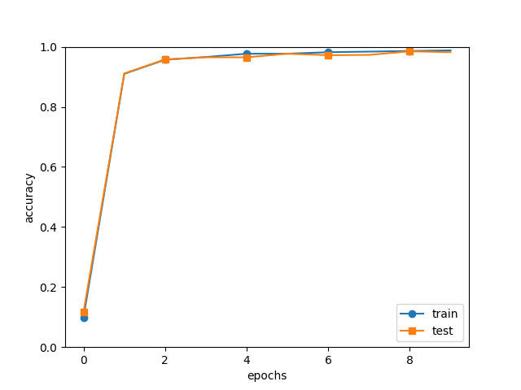

# -Python-Lenet5-
### 参考资料
斋藤康毅 陆宇杰 《深度学习入门 基于Python的理论与实现》  
### Requirments
matplotlib==3.6.2 

numpy==1.23.4 

tensorflow==2.10.0(只作为导入mnist数据集使用)
### 概述
只通过Python和numpy库，从数学推Lenet5中的全连接层，卷积层，激活函数，优化函数.搭建Lenet5卷积神经网络，在手写字符识别上应用.  
在lecun论文的基础上，使用了softmax和cross-entropy损失函数,使用BN进行数据标准化，Adam优化器进行更快的梯度迭代方向，
im2col使浮点数运算更快.
tensorflow 只作为导入mnist数据集,Lecun论文中采用32*32的输入图片不同,mnist采用28*28的图片作为输入;Lecun采用5*5的卷积核,
本代码采用3*3的卷积核.
### 训练过程准确率变化趋势
进行10轮迭代的训练，训练完毕后可以将参数进行保存,可以达到98%的准确率的识别.

